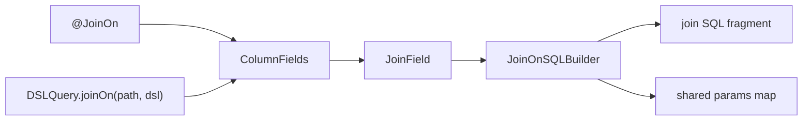

# Join On Scoped DSL Design

**Goal:** Add extra `join on` conditions without breaking the existing annotation model or string DSL style.

## Summary

The current join path always renders a fixed equality predicate from `@JoinColumn` or `@JoinColumns`. This design adds optional scoped DSL conditions that are appended to `on`, while keeping existing queries unchanged.

The new capability has two entry points:

- Field annotation: `@JoinOn("(and(enabled eq true))")`
- Runtime API: `DSLQuery.joinOn("org", "(and(type eq SALES))")`

Both feed the same internal model and are merged with `and`.

## DSL Semantics

The feature reuses the existing DSL syntax:

```java
(and(enabled eq true)(tenantId eq @parent.tenantId))
```

Field resolution is scoped to the current join:

- Bare field name: current join target (`self`)
- `self.xxx`: current join target
- `parent.xxx`: immediate owner of the join
- `root.xxx`: root query object

Values that start with `@` are treated as field references instead of bound parameters:

- `@parent.tenantId`
- `@root.companyId`
- `@self.code`

This is only enabled for join-on rendering. Normal `where` behavior stays unchanged.

## Compatibility Rules

- No `@JoinOn` and no `DSLQuery.joinOn(...)` means generated SQL stays byte-for-byte compatible with the current implementation.
- Existing `where`, `sort`, `deepJoinIncludes`, and `selectIgnores` behavior remains unchanged.
- The new syntax does not modify `@JoinColumn` or `@JoinColumns`.

## SQL Rendering

Base join equality remains first, then extra predicates are appended with `and`.

```sql
left join t_org org_
  on org_.id = t_user.org_id
 and org_.enabled = :j0_p0
 and org_.tenant_id = t_user.tenant_id
```

## Boundaries

- Extra `on` predicates can reference mapped `@Column` fields from `self`, `parent`, or `root`.
- They do not reference raw join-key column names unless those columns are also modeled as `@Column` fields.
- For `@JoinColumns`, v1 appends scoped predicates to the final target-table join, not to intermediate bridge joins.
- Unknown scoped fields fail fast instead of silently rendering `true`.

## Internal Design

### New API surface

- Add `@JoinOn`
- Add `DSLQuery.joinOn(String path, String dsl)`

### Builder flow



### Main implementation pieces

- `DSLQuery`: store runtime join-on DSL strings by join path
- `ColumnFields`: pass merged join-on definitions into each `JoinField`
- `JoinField`: render base equality plus extra scoped predicates
- `JoinOnSQLBuilder`: resolve scoped field names and bind params into the main query param map
- `SingleExpression`: support builder-opted field-reference values for join-on rendering only

## Test Strategy

- Annotation-driven join-on adds constant predicate to `on`
- Runtime `joinOn(path, dsl)` adds predicate to `on`
- Annotation and runtime conditions merge with `and`
- `@parent.xxx` renders a column-to-column comparison
- Unknown scoped field throws
- Existing join SQL snapshots remain unchanged when no join-on is configured
